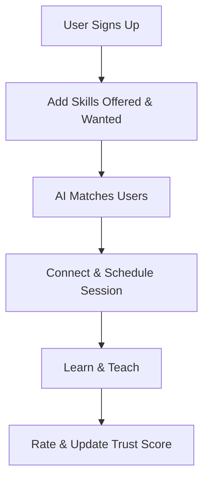

# 🚀 SkillSwap AI  
### *Swap Skills. Grow Together.*

<p align="center">
  
  
  
  
</p>

---

## 🌍 Overview  
SkillSwap AI is a peer-to-peer learning platform where users **exchange skills instead of money**. It connects learners and mentors through smart matching to create a **collaborative and accessible learning ecosystem**.

---

## 💡 Problem  
- Learning is often expensive and inaccessible  
- Lack of personalized guidance  
- Limited peer-to-peer knowledge exchange  

---

## 🎯 Solution  
SkillSwap AI enables users to **learn and teach by exchanging skills**, powered by intelligent matching and a trust-based system.

---

## ✨ Features  

- 🤝 **Skill Exchange** :  Learn and teach without paying  
- 🧠 **Smart Matching** : AI-based partner recommendations  
- 💬 **Real-Time Communication** : Chat and session scheduling  
- 📊 **Progress Tracking** : Monitor your learning journey  
- 🛡️ **Trust Meter** : Ratings-based credibility system  
- 🎮 **Gamification** : XP, badges, and engagement rewards  

---

## 🧩 How It Works  


---

## ⚙️ Tech Stack  

| Layer     | Technology                          |
|-----------|------------------------------------|
| Frontend  | HTML,CSS                           |
| Backend   | Django                             |
| AI        | OpenAI API / Logic-based Matching  |
| Design    | Canva / Figma                      |

---

## 🌱 Impact  

- Free and accessible learning  
- Strong community-driven growth  
- Skill-based economy model  

---

## 🚀 Future Scope  

- 🌐 Multi-language support  
- 🎓 Skill certification system  
- 🤖 AI mentor guidance  
- 📈 Advanced analytics  

---

## 🛠️ Installation  

```bash
# Clone the repository
git clone https://github.com/your-username/skillswap-ai.git

# Navigate to project folder
cd skillswap-ai

# Install dependencies
npm install

# Run the project
npm start
